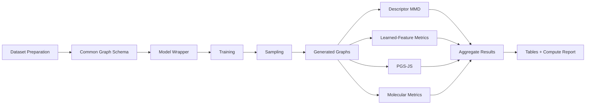

# Graph Generative Model Benchmark

A reproducible benchmark and evaluation framework for **modern graph generative models** across synthetic and molecular graph datasets.

This project accompanies my research on **time-dependent graph generation**, where graph generators are studied through a unified perspective based on probability paths, state spaces, evolution dynamics, training objectives, and sampling mechanisms.

The benchmark is designed to answer a practical research question:

> **When graph generative models are evaluated under the same datasets, sample budgets, and metric families, how consistent are the conclusions across different evaluation protocols?**

It provides a common pipeline for training, sampling, evaluating, comparing, and reporting graph generative models spanning discrete diffusion, continuous-time jump processes, constrained generation, score-based models, and bridge-based approaches.

---

## Portfolio Highlights

This repository demonstrates experience in:

- **Generative AI benchmarking**
- **Graph neural networks and graph generation**
- **Discrete diffusion and denoising models**
- **Continuous-time Markov chains (CTMCs)**
- **Score-based generative modeling**
- **Flow / bridge-based graph generation**
- **Molecular graph generation**
- **Research software engineering**
- **Reproducible ML experimentation**
- **Model-wrapper and integration architecture**
- **Metric design and statistical evaluation**
- **Compute-budget and runtime analysis**
- **Automated LaTeX result generation**
- **PyTorch, PyTorch Geometric, NetworkX, and RDKit workflows**

---

## Research Context

The accompanying survey, **“Time-Dependent Graph Generation: A Survey of Discrete-Time and Continuous-Time Perspectives,”** organizes graph generation around a common temporal and transport-based view.

The core idea is that many seemingly different graph generators can be interpreted as learning a trajectory

```text
reference distribution
        ↓
time-indexed intermediate states
        ↓
target graph distribution
```

with different choices of:

- time representation,
- state space,
- probability path,
- evolution dynamics,
- training objective,
- sampling strategy,
- graph-specific validity mechanisms.

This benchmark operationalizes the evaluation part of that perspective by running representative models under a common experimental framework.

---

## What the Benchmark Evaluates

Graph generation quality is multi-dimensional. No single metric reliably captures structural fidelity, diversity, validity, and distributional similarity.

The benchmark therefore combines four complementary metric families.

### 1. Descriptor-Based Distributional Metrics

Generated and reference graphs are compared through interpretable graph statistics such as:

- degree distributions,
- clustering coefficients,
- orbit counts,
- Laplacian spectral statistics.

Distribution differences are measured using **Maximum Mean Discrepancy (MMD)**.

### 2. Learned-Feature Metrics

Graphs are embedded into a feature space and compared using feature-space distribution distances.

This captures structural information that may be missed by manually chosen descriptors.

### 3. Classifier-Based Two-Sample Metrics

The benchmark supports **PolyGraphScore / PGS-JS**, which asks how easily a probabilistic classifier can distinguish generated graphs from reference graphs.

Lower PGS-JS indicates that the two graph sets are harder to distinguish under the chosen test.

### 4. Intrinsic Molecular Metrics

For molecular datasets, the benchmark additionally reports:

- validity,
- uniqueness,
- novelty,
- atom-type MMD,
- bond-type MMD,
- valid-unique-novel rate.

The purpose is not to collapse model quality into one scalar score, but to examine **agreement and disagreement across complementary evaluation signals**.

---

## Supported Datasets

The benchmark currently covers two structural and two molecular graph datasets.

| Dataset | Type | Main Purpose |
|---|---|---|
| **SBM** | Synthetic topology | Community-structured graph generation |
| **Planar** | Synthetic topology | Constraint-sensitive graph generation |
| **QM9** | Molecular graph | Small attributed molecular generation |
| **ZINC** | Molecular graph | Drug-like molecular generation |

The paper-facing benchmark uses fixed preparation rules and common sample budgets to improve comparability across models.

---

## Model Families

The benchmark integrates representative models from several major graph-generation paradigms.

| Model | Generative Family | State / Dynamics |
|---|---|---|
| **GraphGUIDE** | Discrete diffusion | Bernoulli edge-space denoising |
| **DiGress** | Discrete diffusion | Categorical node-edge denoising |
| **ConStruct** | Constraint-aware diffusion | Edge-absorbing diffusion + projection |
| **EDP-GNN** | Score-based generation | Continuous adjacency + Langevin sampling |
| **DisCo** | Continuous-time diffusion | Discrete-state CTMC |
| **GruM** | Bridge-based generation | OU bridge-mixture dynamics |

Additional wrappers and integration scaffolding are included for other methods used during development.

---

## Unified Benchmark Pipeline



Each model is accessed through a benchmark-facing wrapper so that heterogeneous upstream codebases can be evaluated through a common interface.

---

## Engineering Design

### Model Wrappers

The repository isolates model-specific training and sampling logic from the benchmark itself.

Wrappers normalize:

- configuration,
- dataset conversion,
- training,
- checkpoint handling,
- generation,
- graph serialization,
- runtime diagnostics.

This avoids rewriting the evaluation pipeline for every research codebase.

### Canonical Graph Representation

Attributed graphs use a common NetworkX schema:

```text
node["node_label"]                 categorical node / atom label
node["feats"]                      numeric node feature vector
edge["edge_type"]                  categorical edge / bond label
edge["edge_attr"]                  numeric edge feature vector
graph.graph["molecular_target"]    optional molecular target
```

This allows evaluation code to operate independently of each model's internal tensor representation.

### Repeated Experiments

The benchmark supports run-aware training and sampling, including:

- independent random seeds,
- run-specific checkpoints,
- run-specific generated samples,
- aggregated mean / standard deviation,
- automated status tracking.

### Compute Accounting

The framework records and reports:

- training epochs,
- sampling budgets,
- training time,
- sampling time,
- peak GPU memory,
- hardware/software environment.

This matters because two models with similar graph-quality metrics may have very different generation costs.

---

## Experimental Protocol

The paper-facing benchmark uses:

- **three independent runs per model-dataset pair**,
- **1,024 generated graphs per run**,
- common reference sample sizes,
- fixed preprocessing,
- common metric implementations wherever possible.

Synthetic experiments compare structural graph distributions using degree, clustering, orbit, spectral, feature-space, and classifier-based metrics.

Molecular experiments additionally evaluate categorical atom/bond distributions and chemical quality.

---

## Selected Benchmark Findings

The benchmark is intended as a **consistency analysis**, not a definitive leaderboard.

### Synthetic Graphs

Under the reported protocol:

- **ConStruct** is especially consistent across descriptor-based and classifier-based metrics on Planar and SBM.
- **DiGress** is highly competitive on degree and learned-feature signals.
- Different metric families often produce different model rankings.

This is an important observation: disagreement between metrics can reveal *which structural aspects* of a generated distribution are matched and which remain distinguishable.

For example, on the reported SBM benchmark:

| Model | Degree MMD ↓ | Clustering MMD ↓ | Orbit MMD ↓ | Spectral MMD ↓ | PGS-JS ↓ |
|---|---:|---:|---:|---:|---:|
| ConStruct | 0.0002 | 0.0070 | 0.0007 | 0.0009 | 0.0472 |
| DiGress | 0.0001 | 0.0119 | 0.0014 | 0.0015 | 0.1659 |
| DisCo | 0.0003 | 0.0198 | 0.0024 | 0.0017 | 0.1022 |
| GruM | 0.0032 | 0.0302 | 0.0059 | 0.0150 | 0.2952 |

Values above are means across the reported repeated runs; see the research paper for the complete tables and uncertainty values.

### Molecular Graphs

The molecular experiments show that:

- high molecular validity does not necessarily imply accurate atom/bond distribution matching,
- uniqueness and novelty can saturate and therefore become less discriminative,
- feature-based and classifier-based metrics provide additional evidence beyond validity alone.

On the reported QM9 benchmark, GruM reaches full validity in the experiment, while ConStruct, DiGress, and DisCo show different trade-offs across bond-type, feature-space, and classifier-based metrics.

---

## Compute-Aware Comparison

One feature of this benchmark is that model quality is considered together with inference cost.

For example, in the reported experiments on SBM:

| Model | Training Time | Sampling Time / 128 Graphs |
|---|---:|---:|
| ConStruct | 1.99 h | 7.20 min |
| DiGress | 1.84 h | 3.28 min |
| DisCo | 3.90 h | 20.79 s |
| EDP-GNN | 1.20 h | 5.71 min |
| GraphGUIDE | 1.10 h | 3.79 min |
| GruM | 2.52 h | 6.52 min |

This makes the project useful not only for model-quality comparison, but also for studying the **quality–sampling-cost trade-off** across generative paradigms.

---

## Repository Layout

```text
configs/                         dataset, model, metric, experiment configs
scripts/                         CLI entry points
src/empirical_comparison/        benchmark package
external/                        upstream model / metric repositories
outputs/                         datasets, checkpoints, samples, metrics
tests/                           benchmark tests
```

Typical artifacts:

```text
outputs/datasets/<dataset>/
outputs/checkpoints/<dataset>/<model>/
outputs/runs/<dataset>/<model>/
outputs/samples/<dataset>/<model>/
outputs/metrics/<dataset>/<model>/
outputs/tables/
```

---

## Quick Start

### Install

```bash
python -m venv .venv
source .venv/bin/activate

pip install -r requirements.txt
export PYTHONPATH=src
```

PyTorch and PyTorch Geometric wheels may need to be selected for the local CUDA environment.

---

### Prepare a Dataset

```bash
PYTHONPATH=src python scripts/prepare_data.py   --dataset sbm   --force
```

For molecular data:

```bash
PYTHONPATH=src python scripts/prepare_data.py   --dataset qm9   --download-root outputs/raw_datasets/qm9   --force
```

---

### Train a Model

```bash
PYTHONPATH=src python scripts/train_model.py   --dataset planar   --model digress   --seed 42   --run-id 0   --use-run-paths
```

---

### Generate Samples

```bash
PYTHONPATH=src python scripts/generate_samples.py   --dataset planar   --model digress   --num-samples 1024   --seed 42   --run-id 0   --use-run-paths   --force
```

---

### Evaluate Structural Metrics

```bash
PYTHONPATH=src python scripts/evaluate_descriptor_metrics.py   --dataset sbm   --model digress   --reference-split test   --max-reference-graphs 1024   --max-generated-graphs 1024
```

---

### Evaluate PolyGraphScore / PGS-JS

```bash
PYTHONPATH=src python scripts/evaluate_polygraphscore_official.py   --dataset qm9   --model disco   --run-ids 0 1 2   --max-reference-graphs 1024   --max-generated-graphs 1024   --num-splits 5   --classifier auto
```

---

### Evaluate Learned Features

```bash
PYTHONPATH=src python scripts/evaluate_learned_feature_metrics.py   --dataset qm9   --model disco   --run-ids 0 1 2   --reference-split train   --encoder wl_subtree   --max-reference-graphs 1024   --max-generated-graphs 1024
```

---

### Aggregate Results

```bash
PYTHONPATH=src python scripts/aggregate_results.py   --run-ids 0 1 2

PYTHONPATH=src python scripts/make_latex_tables.py
```

---

## Why This Project Is Interesting

Comparing generative models from different papers is harder than simply copying numbers from their tables.

Reported performance can change because of:

- dataset preprocessing,
- train/validation/test splits,
- number of generated samples,
- metric implementations,
- random seeds,
- model checkpoints,
- solver settings,
- diffusion or sampling steps,
- validity filtering,
- post-processing.

This repository addresses that engineering problem by placing heterogeneous graph generators inside a **common experimental contract**.

The project therefore combines two kinds of work:

### Research

- understanding modern graph-generative paradigms,
- designing fair cross-family comparisons,
- studying evaluation reliability,
- interpreting disagreements between metrics.

### Engineering

- integrating independent research repositories,
- converting incompatible data representations,
- handling model-specific environments,
- managing checkpoints and repeated runs,
- building reusable metric pipelines,
- generating reproducible reports automatically.

---

## Research Questions

This benchmark supports investigation of questions such as:

1. **Do descriptor-based, learned-feature, and classifier-based metrics agree on which graph generator is better?**
2. **How does model ranking change between synthetic and molecular domains?**
3. **What is the relationship between graph validity and distributional fidelity?**
4. **How much generation quality is gained for additional sampling cost?**
5. **Do discrete graph-space models behave differently from relaxed-state models under common evaluation?**
6. **How should graph-generation benchmarks report uncertainty and repeated-run variation?**
7. **How can research implementations with incompatible APIs be evaluated fairly under a shared protocol?**

---

## Research Paper

This benchmark accompanies:

> **Time-Dependent Graph Generation: A Survey of Discrete-Time and Continuous-Time Perspectives**  
> Quang Nguyen, Muhammad Farhan, and Asiri Wijesinghe, 2026.

The paper develops a unified taxonomy of time-dependent graph generation and discusses:

- discrete-time denoising and diffusion,
- iterative graph refinement,
- continuous normalizing flows,
- flow matching,
- continuous-time Markov chains,
- stochastic and belief-space generation,
- bridge-based graph generation,
- graph validity and constraints,
- evaluation methodology,
- applications and open challenges.

The benchmark implements the empirical comparison and reproducibility framework used in the survey.

---

## Reproducibility

The project is designed so that results can be reconstructed from:

- dataset configuration,
- model configuration,
- random seed,
- run identifier,
- generated sample artifact,
- metric configuration.

Run-specific artifacts are kept separate, and result aggregation is performed only after the individual experiment outputs have been recorded.

---

## Tests

```bash
PYTHONPATH=src python -m pytest -q
```

---

## About This Project

This project is part of my PhD research in **Generative AI**, with a focus on **deep generative models for graphs**.

It demonstrates my ability to work across the full ML research workflow:

```text
literature review
    ↓
model analysis
    ↓
research-code integration
    ↓
experiment design
    ↓
GPU training
    ↓
generative sampling
    ↓
statistical evaluation
    ↓
reproducible reporting
```

I am particularly interested in **Generative AI, ML Research Engineering, Graph Machine Learning, model evaluation, and research-to-code projects**.

---

## Citation

If you use the benchmark or accompanying survey, please cite the corresponding paper / benchmark release once the final publication metadata is available.

A benchmark code release is referenced in the manuscript as:

> Quang Nguyen. *Time-Dependent Graph Generation Survey]{Time-Dependent Graph Generation: A Survey of Discrete-Time and Continuous-Time Perspectives*. 2026.

---

## License

Add the appropriate repository license before public release.
